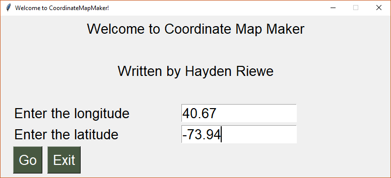

# CoordinateMapMaker (v 0.2)

This simple program gets a longitude and latitude from the user and then generates an interactive map. When the user enters the coordinates, a HTML file is generated and automaticly opened in the default browser. The map will show a marker with the exact location of the coordinates entered. More features are coming soon.

## Set up
You will need Python. If you don't have it you can download it [here](https://www.python.org/downloads/)

Clone the souce:
`git clone https://github.com/hriewe/CoordinateMapMaker.git`

Move into the programs direrctory:
`cd CoordinateMapMaker`

## How to run (GUI)
Install the needed modules with:

`sudo pip install PySimpleGUI`

`sudo pip install folium`

Run the program:
`python3 GUI.py`

## How to run (command line)
Install the needed modules with:
`sudo pip install folium`

Run the program:
`python3 map.py`

